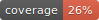

# Reperio

<div align="center">

[](https://github.com/lewismc/reperio/actions?query=workflow%3Abuild)
[](https://pypi.org/project/reperio/)
[](https://github.com/lewismc/reperio/pulls?utf8=%E2%9C%93&q=is%3Apr%20author%3Aapp%2Fdependabot)

[](https://github.com/astral-sh/ruff)[](https://github.com/PyCQA/bandit)
[](https://github.com/lewismc/reperio/blob/main/.pre-commit-config.yaml)
[](https://github.com/lewismc/reperio/releases)
[](https://github.com/lewismc/reperio/blob/main/LICENSE)


[Reperio](https://glosbe.com/la/en/reperio) is a high-performance visualization utility for [Apache Nutch](https://nutch.apache.org) data structures including CrawlDB, LinkDB, and HostDB.

**Key Features:**
- 🚀 **Fast**: WebGL-powered visualization using Sigma.js for millions of nodes
- 🔗 **Integrates with Nutch**: Works with Nutch tool exports (readdb, readlinkdb, readhostdb)
- 🌐 **Flexible**: Supports compressed/uncompressed SequenceFiles, Nutch exports, local filesystem, and HDFS
- 📊 **Comprehensive**: Built-in graph analysis (PageRank, centrality, components)
- 🎨 **Interactive**: Real-time filtering, search, and exploration
- 🔧 **Developer-Friendly**: REST API, CLI, and web interface

</div>

## Architecture

```
┌─────────────────────────────────────────────────────────────────────────┐
│                        Data Source Layer                                │
│  ┌─────────────┐                         ┌──────────────────────────┐  │
│  │   Local FS  │                         │  Nutch Database          │  │
│  │    HDFS     │                         │  /crawldb/               │  │
│  └─────────────┘                         │    current/              │  │
│         │                                 │      part-r-00000/data   │  │
│         │                                 │      part-r-00001/data   │  │
│         │                                 │      part-r-00002/data   │  │
│         │                                 └──────────────────────────┘  │
└─────────┼────────────────────────────────────────────┬─────────────────┘
          │                                            │
          ▼                                            ▼
  ┌──────────────┐                          ┌──────────────────────┐
  │  FileSystem  │◀─────────────────────────│  Partition Discovery │
  │   Manager    │                          │  (Auto-detect all    │
  └──────────────┘                          │   part-r-* files)    │
          │                                 └──────────────────────┘
          │                                            │
          ▼                                            │
  ┌───────────────────────────────────────────────────┘
  │
  ▼
┌─────────────────────────────────────────────────────────────────────────┐
│                      Reader Layer (with Factory)                        │
│                                                                          │
│  ┌────────────────────────────────────────────────────────────────┐    │
│  │  create_nutch_reader()  ← Factory Function                     │    │
│  │  • Detects single vs multi-partition                           │    │
│  │  • Returns appropriate reader                                  │    │
│  └────────────────────────────────────────────────────────────────┘    │
│                    │                              │                     │
│         Single File│                              │Multi-Partition      │
│                    ▼                              ▼                     │
│        ┌───────────────────┐        ┌────────────────────────┐         │
│        │ SequenceFile      │        │ NutchDatabaseReader    │         │
│        │ Reader            │        │ • Aggregates partitions│         │
│        │ • Single partition│        │ • Progress reporting   │         │
│        │ • Compression     │        │ • Sequential reading   │         │
│        └───────────────────┘        └────────────────────────┘         │
└─────────────────────────────────────────────────────────────────────────┘
                    │                              │
                    └──────────────┬───────────────┘
                                   ▼
                          ┌───────────────┐
                          │  Data Parser  │
                          │  (CrawlDB/    │
                          │  LinkDB/      │
                          │  HostDB)      │
                          └───────────────┘
                                   │
                                   ▼
                          ┌───────────────┐
                          │ Graph Builder │
                          │  (NetworkX)   │
                          └───────────────┘
                                   │
           ┌───────────────────────┼───────────────────────┐
           ▼                       ▼                       ▼
   ┌───────────────┐      ┌──────────────┐       ┌──────────────┐
   │   FastAPI     │      │     CLI      │       │  Exporter    │
   │     API       │      │   Commands   │       │  (JSON/GEXF) │
   │ • REST API    │      │ • serve      │       └──────────────┘
   │ • Graph data  │      │ • web        │
   └───────────────┘      └──────────────┘
           │
           ▼
   ┌───────────────┐
   │ React + Vite  │
   │  Frontend     │
   │  (Sigma.js)   │
   └───────────────┘
```

## Installation

### Prerequisites

- Python 3.10 or higher
- Node.js 18+ and npm (for frontend development)
- Optional: HDFS access (with pyarrow) for reading from Hadoop clusters

### Backend Installation

```bash
# Clone the repository
git clone https://github.com/lewismc/reperio.git
cd reperio

# Create a virtual environment
python3 -m venv venv

# Activate the environment
source venv/bin/activate  # On macOS/Linux
# or
venv\Scripts\activate  # On Windows

# Install reperio
pip install -e .

# Optional: Install with HDFS support
pip install -e ".[hdfs]"

# Upgrade Typer if needed (requires 0.21+)
pip install --upgrade 'typer>=0.21.0'
```

### Running Commands

Always activate the virtual environment before running commands:

```bash
# Activate the environment
source venv/bin/activate  # On macOS/Linux
# or
venv\Scripts\activate  # On Windows

# Run reperio commands
reperio --help

# Load single dataset
reperio web --crawldb path/to/crawldb

# Load multiple datasets (recommended!)
reperio web --crawldb path/to/crawldb --linkdb path/to/linkdb

# Deactivate when done
deactivate
```

### Frontend Installation

The frontend provides interactive graph visualization using React, Vite, and Sigma.js.

```bash
# Navigate to frontend directory
cd frontend

# Install dependencies
npm install

# Build the frontend for production (required for visualization)
npm run build

# This creates a 'dist' folder that the backend serves
```

**Important**: The frontend must be built before you can use interactive visualization. If you see the warning "Frontend not built" when running `reperio web`, run `npm run build` in the frontend directory.

**Development mode** (optional, for frontend development only):
```bash
# Run development server with hot reload
npm run dev
```

## Quick Start

### Division of Responsibilities

**Nutch handles statistics:**
```bash
# CrawlDB statistics
nutch readdb /path/to/crawldb -stats

# LinkDB statistics
nutch readlinkdb /path/to/linkdb -stats

# HostDB statistics
nutch readhostdb /path/to/hostdb -stats
```

**Reperio handles visualization:**
- Export Nutch data as graph files
- Interactive web-based visualization
- Graph analysis (PageRank, centrality, etc.)

### 1. Interactive Web Visualization

**Prerequisites**: Build the frontend first (see [Frontend Installation](#frontend-installation))

Start the web UI with your data in one command:

```bash
# Load single dataset
reperio web --crawldb /path/to/crawldb

# Load multiple datasets (recommended!)
reperio web --crawldb /path/to/crawldb --linkdb /path/to/linkdb

# Load all three datasets
reperio web --crawldb /path/to/crawldb --linkdb /path/to/linkdb --hostdb /path/to/hostdb

# From HDFS (supports multi-partition)
reperio web --crawldb hdfs://namenode:9000/nutch/crawldb --linkdb hdfs://namenode:9000/nutch/linkdb

# With limits for large datasets
reperio web --crawldb /path/to/crawldb --max-records 50000

# Without opening browser
reperio web --crawldb /path/to/crawldb --no-open
```

**Why load multiple datasets?** Loading both CrawlDB and LinkDB together provides the complete picture of your crawl - nodes (pages) from CrawlDB and links between them from LinkDB. The frontend allows you to switch between datasets interactively.

Or start just the API server:

```bash
# Server loads data and exposes REST API
reperio serve --crawldb /path/to/crawldb --port 8000

# Load multiple datasets
reperio serve --crawldb /path/to/crawldb --linkdb /path/to/linkdb --port 8000

# Access API docs at: http://localhost:8000/docs
```

**Features:** 
- ✓ **Multi-partition support**: Automatically reads all partitions in a Nutch database directory
- ✓ **Compressed files**: Supports DefaultCodec, Gzip, BZip2. See [Compression Guide](docs/COMPRESSION.md)
- ✓ **Progress reporting**: Shows which partition is being processed for large databases
- ✓ **Interactive visualization**: WebGL-based graph rendering with Sigma.js

**About the Visualization:**

The `reperio web` command provides interactive graph visualization through a React + Sigma.js frontend:
- **Multiple Datasets**: Load and switch between CrawlDB, LinkDB, and HostDB interactively
- **Nodes**: URLs from your Nutch data, sized and colored by attributes (status, score, etc.)
- **Edges**: Link relationships (for LinkDB data)
- **Dataset Switcher**: When multiple datasets are loaded, use the dropdown in the control panel to switch between them
- **Interactive controls**: Pan, zoom, node selection, filtering
- **Layout**: Force-directed positioning using ForceAtlas2 algorithm
- **Node details**: Click any node to see metadata (status, score, fetch time, etc.)

**Important**: If you see "Frontend not built" warning, the visualization won't work. Build it first:
```bash
cd frontend
npm run build
```

Without the built frontend, you'll only see the API documentation at `http://localhost:8000/docs`, but the REST API endpoints will still work for programmatic access.

### 2. API Usage

The `serve` command loads your data and exposes it via REST API:

```bash
# Start server with data loaded
reperio serve --linkdb /path/to/linkdb --port 8000

# Or load multiple datasets
reperio serve --crawldb /path/to/crawldb --linkdb /path/to/linkdb --port 8000
```

API endpoints available:
- `GET /api/graph` - Full graph data
- `GET /api/nodes` - Node list
- `GET /api/edges` - Edge list  
- `GET /api/summary` - Graph statistics

API documentation: `http://localhost:8000/docs`

Example API calls:

```python
import requests

# First, start the server with data loaded:
# $ reperio serve --crawldb /path/to/crawldb --linkdb /path/to/linkdb --port 8000

# Check loaded datasets
curl http://localhost:8000/api/datasets

# Activate a specific dataset
curl -X POST http://localhost:8000/api/datasets/linkdb/activate

# Get graph summary
summary = requests.get('http://localhost:8000/api/graph/summary').json()
print(f"Nodes: {summary['num_nodes']}, Edges: {summary['num_edges']}")

# Get all nodes
nodes = requests.get('http://localhost:8000/api/graph/nodes').json()

# Get all edges
edges = requests.get('http://localhost:8000/api/graph/edges').json()

# Get full graph data
graph_data = requests.get('http://localhost:8000/api/graph').json()
print(f"Graph has {len(graph_data['nodes'])} nodes and {len(graph_data['edges'])} edges")
```

### 3. Multi-Partition Support

Nutch databases are typically split into multiple partition files for distributed processing. Reperio automatically discovers and reads all partitions, giving you a complete view of your data.

**Nutch Database Structure:**
```
crawldb/
  current/
    part-r-00000/
      data
    part-r-00001/
      data
    part-r-00002/
      data
    ...
```

**Usage - All are equivalent:**
```bash
# Point to database root (recommended - reads all partitions)
reperio web --crawldb /path/to/crawldb

# Point to current directory
reperio web --crawldb /path/to/crawldb/current

# Point to single partition (reads only that partition)
reperio web --crawldb /path/to/crawldb/current/part-r-00000/data
```

**Progress Reporting:**

When reading multiple partitions, Reperio shows real-time progress:
```
Loading crawldb from: /path/to/crawldb
Found 8 partition file(s)
Building graph...
Reading partition 1/8: part-r-00000
Reading partition 2/8: part-r-00001
Reading partition 3/8: part-r-00002
...
✓ Graph built: 150,000 nodes, 2,500,000 edges
```

**Behavior with `--max-records`:**

The limit applies to the **total** across all partitions:
```bash
# Read up to 10,000 records per dataset from all partitions
reperio web --crawldb /path/to/crawldb --max-records 10000
```

## Features

### Data Sources

- **CrawlDB**: URL-level crawl status, scores, and metadata
- **LinkDB**: Link graph with inbound links and anchor text
- **HostDB**: Host-level statistics and aggregations

### Input Formats

- **Nutch Tool Exports** (Recommended): Output from `readdb`, `readlinkdb`, `readhostdb`
  - ✅ Handles all compression formats
  - ✅ Production-ready
  - ✅ Well-tested
- **SequenceFiles** (Direct): Compressed and uncompressed SequenceFiles
  - ✅ Compression support (DefaultCodec, Gzip, BZip2)
  - ✅ Fast direct access
  - ✅ Quick for development/testing

### Storage Support

- **Local Filesystem**: Read from local disk
- **HDFS**: Direct access to Hadoop Distributed File System
- **Auto-detection**: Automatically detects format and storage type

### Graph Analysis

- **PageRank**: Identify important pages
- **Centrality**: In-degree and out-degree centrality
- **Connected Components**: Find strongly/weakly connected subgraphs
- **Host-level Analysis**: Extract and analyze host relationships
- **Filtering**: By status, domain, score range

### Visualization

- **Interactive Graph**: Pan, zoom, and click nodes for details
- **WebGL Rendering**: Smooth performance with 100k+ nodes
- **Customizable Layout**: Force-directed, hierarchical layouts
- **Real-time Search**: Find nodes by URL pattern
- **Export**: JSON, Sigma.js format, GEXF, GraphML

## Nutch Integration

Reperio works best with Apache Nutch's built-in tools. See the [Nutch Integration Guide](docs/NUTCH_INTEGRATION.md) for complete details.

**Quick example:**

```bash
# Step 1: Use Nutch for statistics
nutch readdb /path/to/crawldb -stats

# Step 2: Visualize with Reperio (one command!)
reperio web --crawldb /path/to/crawldb --linkdb /path/to/linkdb

# Alternative: Export to file for Gephi or archiving
reperio export /path/to/crawldb crawldb-graph.gexf --type crawldb --format gexf
```

## Configuration

Create a `.env` file in the project root:

```bash
# HDFS Configuration
HDFS_NAMENODE=namenode.example.com
HDFS_PORT=9000
HADOOP_CONF_DIR=/etc/hadoop/conf

# API Configuration
API_HOST=0.0.0.0
API_PORT=8000

# Cache Configuration
CACHE_ENABLED=true
```

Or use environment variables:

```bash
export HDFS_NAMENODE=namenode.example.com
export HDFS_PORT=9000
reperio serve --crawldb /path/to/crawldb
```

## Development

### Makefile usage

[`Makefile`](https://github.com/lewismc/reperio/blob/main/Makefile) contains functions for faster development.


<details>
<summary>Install all dependencies and pre-commit hooks</summary>
<p>

Install requirements:

```bash
make install
```

Pre-commit hooks coulb be installed after `git init` via

```bash
make pre-commit-install
```

</p>
</details>

<details>
<summary>Codestyle and type checks</summary>
<p>

Automatic formatting uses `ruff`.

```bash
make polish-codestyle

# or use synonym
make formatting
```

Codestyle checks only, without rewriting files:

```bash
make check-codestyle
```

> Note: `check-codestyle` uses `ruff` and `darglint` library

</p>
</details>

<details>
<summary>Code security</summary>
<p>

> If this command is not selected during installation, it cannnot be used.

```bash
make check-safety
```

This command identifies security issues with `Safety` and `Bandit`.

```bash
make check-safety
```

</p>
</details>

<details>
<summary>Tests with coverage badges</summary>
<p>

Run `pytest`

```bash
make test
```

</p>
</details>

<details>
<summary>All linters</summary>
<p>

Of course there is a command to run all linters in one:

```bash
make lint
```

the same as:

```bash
make check-codestyle && make test && make check-safety
```

</p>
</details>

<details>
<summary>Docker</summary>
<p>

```bash
make docker-build
```

which is equivalent to:

```bash
make docker-build VERSION=latest
```

Remove docker image with

```bash
make docker-remove
```

More information [about docker](https://github.com/Undertone0809/python-package-template/tree/main/%7B%7B%20cookiecutter.project_name%20%7D%7D/docker).

</p>
</details>

<details>
<summary>Cleanup</summary>
<p>
Delete pycache files

```bash
make pycache-remove
```

Remove package build

```bash
make build-remove
```

Delete .DS_STORE files

```bash
make dsstore-remove
```

Remove .mypycache

```bash
make mypycache-remove
```

Or to remove all above run:

```bash
make cleanup
```

</p>
</details>

## Alternative Installation Methods

If you prefer to use Poetry for dependency management, see [docs/POETRY.md](docs/POETRY.md) for detailed instructions.

## 📚 Documentation

- **[Troubleshooting Guide](docs/TROUBLESHOOTING.md)** - Solutions for common issues including frontend setup
- **[Compression Support](docs/COMPRESSION.md)** - Working with compressed SequenceFiles
- **[Nutch Integration](docs/NUTCH_INTEGRATION.md)** - Best practices for Nutch data
- **[API Documentation](docs/API.md)** - REST API reference
- **[Deployment Guide](docs/DEPLOYMENT.md)** - Production deployment options
- **[Poetry Guide](docs/POETRY.md)** - Using Poetry for dependency management

## 🛡 License

[](https://github.com/lewismc/reperio/blob/main/LICENSE)

This project is licensed under the terms of the `Apache Software License 2.0` license. See [LICENSE](https://github.com/lewismc/reperio/blob/main/LICENSE) for more details.
